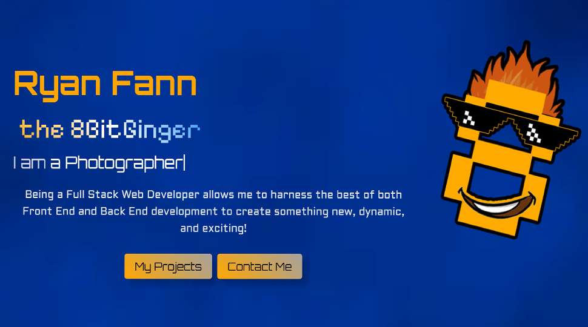
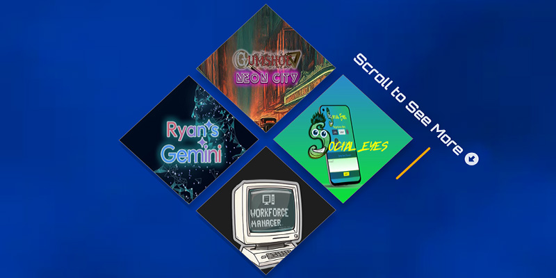
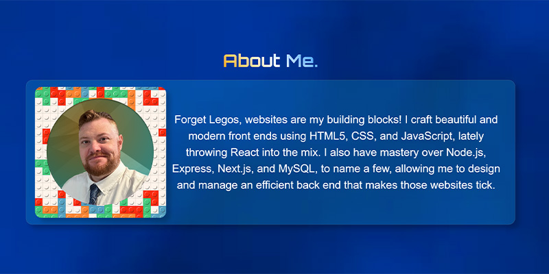
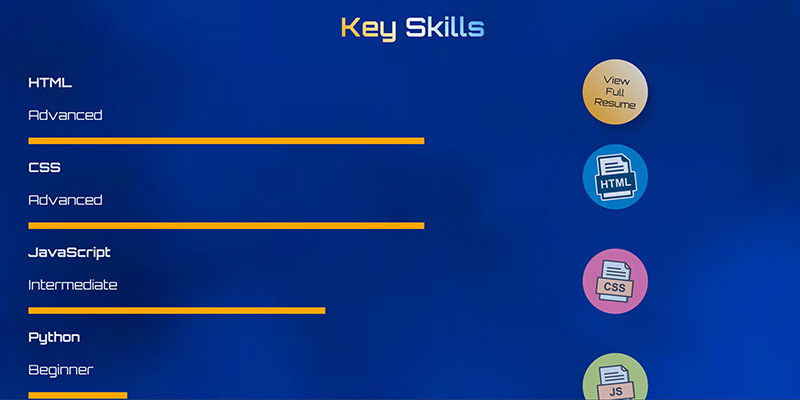
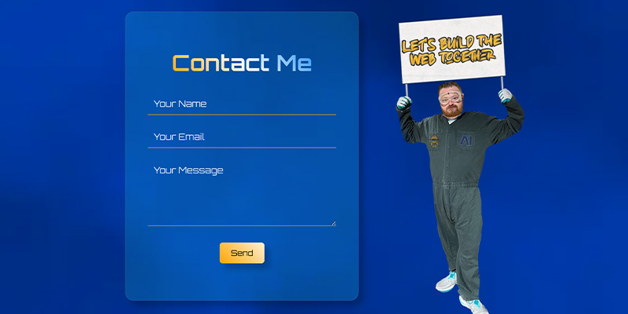

<a id="badges"></a>
[](https://opensource.org/licenses/MIT)

# Web Developer - React Portfolio



## Ryan J. Fann _8BitGinger_

</div>

[](https://app.netlify.com/sites/ryanfann/deploys)

## Description

Welcome to my portfolio, a showcase of my web development journey! This React-built platform invites you to explore my latest creations and ideas. Inspired by a desire to innovate, simplify, and express my identity as a developer, I meticulously crafted this portfolio to present a curated collection of my most compelling projects.

---

## Table of Contents

1. [Screenshots](#screenshot)
2. [License](#license)
3. [Links](#links)
4. [Technologies](#tech)
5. [Questions](#support)

---

<a id="screenshot"></a>

## Screenshots



<details closed>
<summary>Click Here to see more!</summary>
<br>







</details>

---

<a id="license"></a>

## License

**MIT** - [](https://opensource.org/licenses/MIT)

---

<a id="links"></a>

## Links

### Repo Link:[](https://github.com/8BitGinger/fanntasticPortfolio2)

### Deployed Link:[](https://ryanfann.netlify.app/)

<a id="support"></a>

---

<a id="tech"></a>

## Technologies

<div align="center">

[]()
[]()
[]()
[]()
[]()
[]()
[]()


```

"dependencies": {
    "@formspree/react": "^2.5.1",
    "framer-motion": "^11.0.28",
    "react": "^18.2.0",
    "react-dom": "^18.2.0",
    "react-icons": "^5.0.1",
    "react-router-dom": "^6.22.3",
    "react-scripts": "^5.0.1",
    "react-scroll": "^1.9.0",
    "react-type-animation": "^3.2.0"
  },

```

</div>

---

## Questions

<div align="center">

Reach out for Questions or Support here:

[](mailto:ryan.fann@gmail.com)
[](https://github.com/8BitGinger)
[](https://twitter.com/the8bitginger)
[](https://www.linkedin.com/in/ryanfanntastic/)
[](https://www.discord.com/users/wellthatsweird18964)

[](https://github.com/8BitGinger)

</div>
